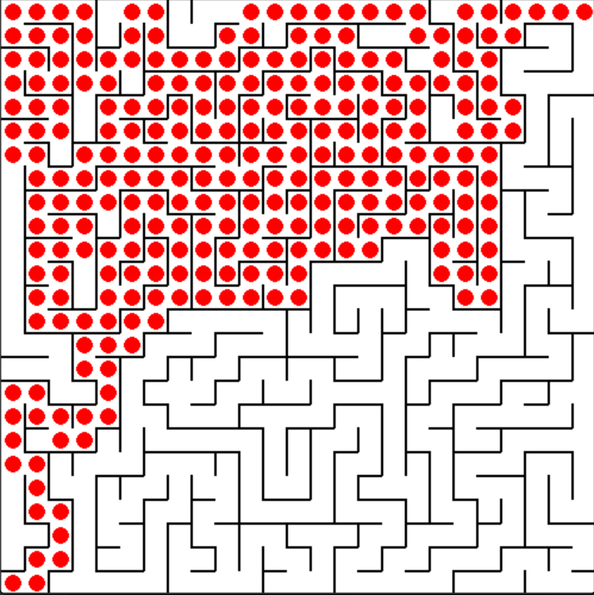

# maze-solver
Generate random mazes and demonstrate different algorithms for solving them. Upon execution, the program can either load a previously generated maze stored in a text file or randomly generate a new one with custom size. Next, different solvers (BFS, DFS and A* or other custom solvers) can be used to find the optimal path to the target and display the solution graphically.

This project was used as a computer assignment for the artificial intelligence course at the University of Tehran in Fall 2015.

## Execution

This program requires installation of Python 3 and pygame. Use the following command to install the latest version of pygame from source (I had some issues running pygame on MacOS Catalina 10.15.4 with the version installed by pip):

```
pip install git+https://github.com/pygame/pygame.git
```

The program can be then ran using:

```
python maze-solver/maze.py
```

## Sample Screenshot

